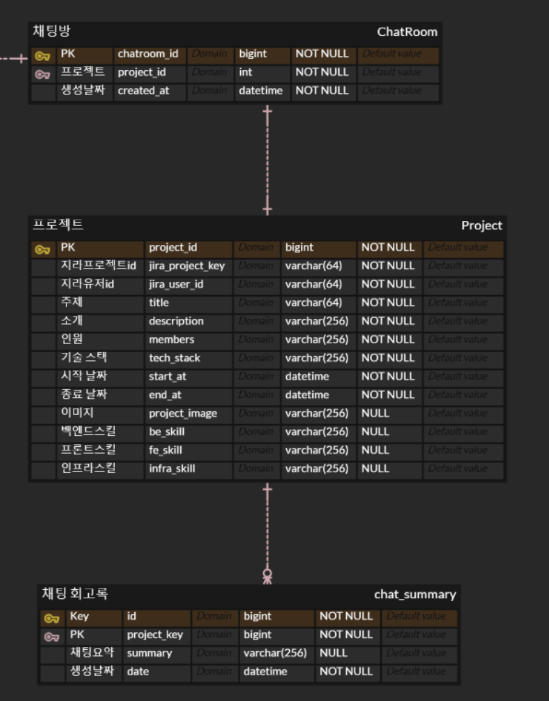

## 📅 **프로젝트 기간**

- 2024.10.14 ~ 2024.11.19

## 개발 관련 기술

### 📋 git 이슈/브랜치 관리

### issue

- 프론트엔드와 백엔드, 데이터는 `label`로 분류한다.
- `assignees`는 이슈 생성자가 스스로 할당한다.
- 이슈 타입

  ```markdown
  FEAT : 새로운 기능 추가
  FIX : 버그 수정
  HOTFIX : 치명적인 버그 급하게 수정
  CHORE : (코드 수정 없는) 설정 변경
  DOCS : 문서 생성 및 수정
  DESIGN : 레이아웃 구현 및 디자인 수정
  REFACTOR : 리팩토링
  REMOVE : 파일/코드 삭제
  MERGE : 브랜치 병합
  ```

- 작성 예시
  **[타입] 이슈 명**
  - [FEAT] PWA 구현
  - [DESIGN] 랜딩 페이지 레이아웃 디자인

### branch

- 프론트엔드, 백엔드, 데이터는 접두사로 **`FE/ BE/ DATA/`** 를 붙인다.
- 브랜치 생성 시, 영문은 모두 **소문자**를 사용한다.
- git flow 방식을 채용하여 dev branch로 protect한다.
- 완료 된 작업에 대하여 PR 완료 이후 해당 작업 브랜치는 삭제한다.
- 생성 예시

  **분야/타입/#이슈번호\_이슈명**

### commit

- 영문은 모두 **소문자**를 사용한다.
- 한글도 가능하다.
- 생성 예시
  - docs: TIL 생성
  - feat: PWA setting

### merge

- 영문은 모두 **소문자**를 사용한다.
- 내용은 템플릿을 사용한다.

### 👩🏻‍🔧 **기술 스택**

<div align="left">

### FE

---

#### 🚀 프레임워크 및 라이브러리

  
  
   
  
  #### 📊 상태 관리
   
  
  
  #### 📡 데이터 요청
  
  
  #### 💄 스타일링
   
  
  
  #### 🔧 코드 품질 관리
  
  

### BE

---

#### 🚀 프레임워크 및 라이브러리

 
 


#### 📂 DB 및 스토리지

 
 


### AI

---


### INFRA

---

#### 🔗 CI/CD

 
 

<br>

## 📖 **ERD**




<br>

## 📖 **Architecture**


<br>

## 📖 **페이지별 기능**

### 1. 로그인


### 2. 프로젝트


### 2-1 프로젝트 정보


### 2-2 프로젝트 채팅 회고록


매일 자정마다 그날의 채팅을 요약및 정리해주는 회고록

### 2-3 프로젝트 채팅


프로젝트 별 채팅

### 2-3 챗봇


jira에 대해 물어볼 수 있는 챗봇

### 2-4 전체 업무 로그


본인에게 할당된 이슈들을 편집 및 수정, 드래그 앤드롭 기능

### 2-4 전체 업무 로그 수정


이슈 편집 및 수정
