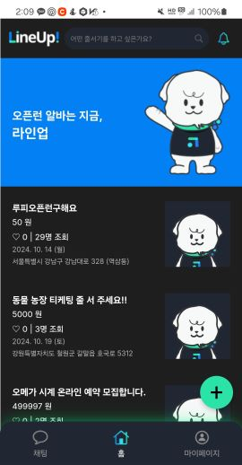
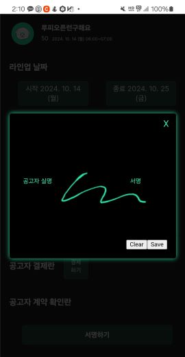

#  


##  🎥 프로젝트 개요
> 줄서기 대행, 구매 대행 관련 플랫폼 서비스

### 프로젝트 제안배경
> 오픈런 서비스, 줄서기 구매 대행에 대한 수요 증가<br/> 기존 플랫폼 서비스 사용자들을 대상으로 인터뷰 결과<br/> 계약서, 보증금 등 서비스 이용 신뢰도 문제 해결

### 개발 기간
> 2024-08-19 ~ 2024 -10-11

### 실행 환경 
> |   TECH    | Version  |
> | --------- | ---------|
> |   React  |  18.3.1 |
> |   livekit-client     |  2.4.0  |
> |   spring boot   | 3.3.2  |
> |    java  | 17 |
> |    mySQL  | 8.0.33  |
> |   jwt  | 0.11.2  |
> |   junit | 5.12.0   |
> |   oauth  | 2.0   |


</br>

## 💻 Tech Stack
### 🔐 Backend
> 


### 🌅 Front-end
> 

## 사용 방법
### 🔐 Backend
> ```
> $ ./gradlew clean build;
> $ java -jar build/libs/*SNAPSHOT.jar
> ```
### 🌅 Front-end
> ```
> $ npm install
> $ npm start
> ```


## 🖥️ 목표 서비스 구현 및 실제 구현 정도 및 핵심 기능 설명

|회원가입|
| :---: |
||
|<회원가입&로그인> <br/> Oauth2.0 SNS 로그인 기능 구현 <br /> 중복 이메일, 닉네임 체크 |
<hr>

|홈 화면|
| :---: |
||
| <홈 화면> <br /> 사용자들이 작성한 전체 공고 조회 <br />|
<hr>

|공고 등록|
| :---: |
||
| <공고 등록> <br /> OCR을 통해 네이버 클로바로 이미지에서 텍스트 추출 <br /> gpt API를 활용해 데이터 변환 <br /> 공고 작성시 사용자의 편의 도모 <br />|
<hr>

|공고 지원|
| :---: |
||
| <일반채팅 페이지> <br /> 공고 작성자 외의 사용자가 공고 지원 <br /> |
<hr>

|계약서 작성|
| :---: |
||
| <계약서 작성> <br /> 공고 작성자가 지원자에게 계약 요청 <br /> 서명과 결제 후 계약서 작성 <br />  |
<hr>

|채팅|
| :---: |
||
| <채팅> <br /> 공고 지원하는 경우 채팅방 생성 <br />   |
<hr>
