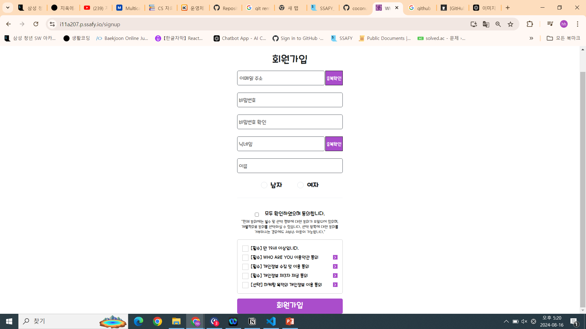
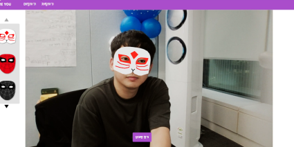
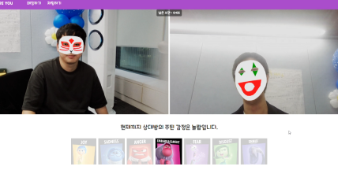
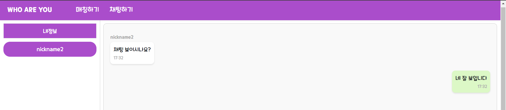
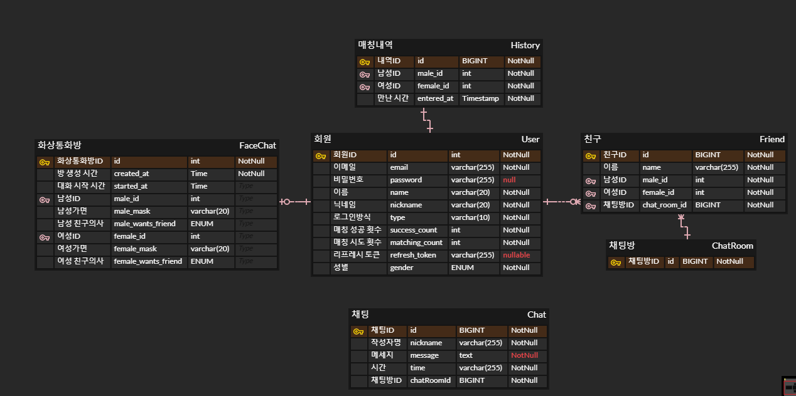

# WHO ARE YOU
<hr>

##  🎥 프로젝트 개요
> OpenVidu와 SockJs를 활용해 실시간 화상 회의와 채팅을 기반으로 한 소개팅 서비스

### 프로젝트 제안배경
> 기존 소개팅이 외모에 기반한 소개팅, 지루하고 재미없는 소개팅,<br/> 상대방의 감정 파악의 어려움을 느껴 재미 요소를 보장하고,<br/> 외모보단 성격 및 상대방 감정 분석이 가능한 <br/> 비대면 소개팅 서비스를 제공

### 개발 기간
> 2024-07-02 ~ 2024 -08-16

<hr>

### 실행 환경 
> |   TECH    | Version  |
> | --------- | ---------|
> |   React  |  18.3.1 |
> |   livekit-client     |  2.4.0  |
> |   spring boot   | 3.3.2  |
> |    java  | 17 |
> |    mySQL  | 8.0.33  |
> |   jwt  | 0.11.2  |
> |   junit | 5.12.0   |
> |   mongodb  | 3.3.0   |
> |   kafka  | 3.8.0   |
> |   oauth  | 2.0   |


</br>

## 💻 Tech Stack
### 🔐 Backend
> 


### 🌅 Front-end
>     

## 사용 방법
### 🔐 Backend
> ```
> $ ./gradlew clean build;
> $ java -jar build/libs/*SNAPSHOT.jar
> ```
### 🌅 Front-end
> ```
> $ npm install
> $ npm start
> ```


## 🖥️ 목표 서비스 구현 및 실제 구현 정도 및 핵심 기능 설명

|회원가입|
| :---: |
||
|<회원가입&로그인> <br/> - 중복 이메일, 닉네임 체크 <br /> - 약관동의 |
<hr>

|가면 미리보기 페이지|
| :---: |
||
| <로그인 성공 후 페이지> <br /> - google mediaPipe를 통해 얼굴 인식 <br /> - landmark 좌표를 기반으로 3D 가면 디자인 <br />|
<hr>

|소개팅 페이지|
| :---: |
||
| <소개팅 메인 페이지> <br /> - openvidu 실시간 비디오 스트리밍과 화상 회의 구현 <br /> - 브라우저와 서버 간의 안정적인 실시간 통신 보장 <br /> - 비디오 내에서 얼굴을 인식하고, 인공지능 기술을 이용하여 감정 분석 <br />|
<hr>

|일반채팅 페이지|
| :---: |
||
| <일반채팅 페이지> <br /> - websocket & stomp 프로토콜 사용 <br /> - 오픈소스 비관계형 데이터베이스 관리시스템 활용 <br />|
<hr>

## ERD
||
