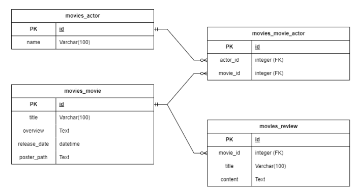

# DB 설계를 활용한 REST API 설계
## INDEX
* 개요
* 준비사항
* 프로젝트 안내
* 요구사항

## 개요
### 프로젝트 개요
* 영화 관련 데이터를 제공하는 RESTful API 서버 구성 단계
* 영화, 배우, 리뷰 데이터의 조회가 가능한 API 서버
* 리뷰 데이터 생성, 수정, 삭제가 가능한 API 서버
* 영화, 배우, 리뷰 간의 모델 관계가 형성된 애플리케이션

### 프로젝트 목표
* Django REST framework를 활용한 API 서버 제작
* HTTP request methods에 대한 이해
* HTTP response status codes에 대한 이해
* Many to one relationship(N:1)에 대한 이해
* Many to many relationship(N:M)에 대한 이해

## 준비사항
### 개발도구
* Visual Studio Code
* Google Chrome
* Django 4.2.x
* Django Rest framework
* Postman

## 프로젝트 안내
### 프로젝트 및 앱
* 프로젝트 이릅 - mypjt
* 앱 이름 - movies

### 초기 데이터 
* 주어진 fixture파일을 movies 앱 내에 위치시킴
* fixture data의 load는 **반드시 모델 정의 및 migrate 이후에 진행**
```bash
$ python manage.py migrate
# json 파일은 movies/fixtures/movies/에 위치
$ python manage.py loaddata movies/actors.json movies/movies.json movies/reviews.json
```

## 요구사항

### 필수 요구사항 - 모델 클래스
* Actor
  * 배우 이름을 저장할 필드 1개 지정 
* Movie
  * 영화 제목, 줄거리, 개봉일, 포스터 주소를 저장할 필드 4개 지정
* Review
  * 리뷰 제목, 내용을 입력할 필드 2개 지정

### 필수 요구사항 - 모델 관계


* **movie - actor => N:M relationship**

* **movie - review => N:1 relationship**

```py
from django.db import models

# Create your models here.
class Actor(models.Model):
    name = models.CharField(max_length=100)

class Movie(models.Model):
    title = models.CharField(max_length=100)
    overview = models.TextField()
    release_date = models.DateTimeField()
    poster_path = models.TextField()
    actors = models.ManyToManyField(Actor) # N:M relationship

class Review(models.Model):
    movie = models.ForeignKey(Movie, on_delete=models.CASCADE) # N:1 relationship
    title = models.CharField(max_length=100)
    content = models.TextField() 
```
### 필수 요구사항 - 모델 별 기능 구현
A. Actor
  * 배우 데이터 조회
B. Movie
  * 영화 데이터 조회
C. Review
  * 리뷰 데이터 조회 / 생성 / 수정 / 삭제

  각 데이터는 JSON 데이터 타입을 따름

### 필수 요구사항 - view 함수
  * movies 앱의 view 함수

| 함수명 | 역할 | 허용 HTTP Method |
| :---: | :--- | :---: |
| actor_list | * 전체 배우 목록 제공 | GET |
| actor_detail | * 단일 배우 정보 제공 (출연 영화 제목 포함) | GET |
| movie_list | * 전체 영화 목록 제공 | GET |
| movie_detail | * 단일 영화 정보 제공 (출연 배우 이름과 리뷰 목록 포함) | GET |
| review_list | * 전체 리뷰 목록 제공 | GET |
| review_detail | * 단일 리뷰 조회 & 수정 & 삭제 (출연 영화 제목 포함) | GET |
| create_review | * 리뷰 생성 | GET |
## 완성 응답 및 코드
### 완성 응답 예시
A. 전체 배우 목록 제공
B. 단일 배우 정보 제공
C. 전체 영화 목록 제공
D. 당일 영화 정보 제공
E. 전체 리뷰 목록 제공 
F. 단일 리뷰 조회 & 수정 & 삭제
G. 리뷰 생성