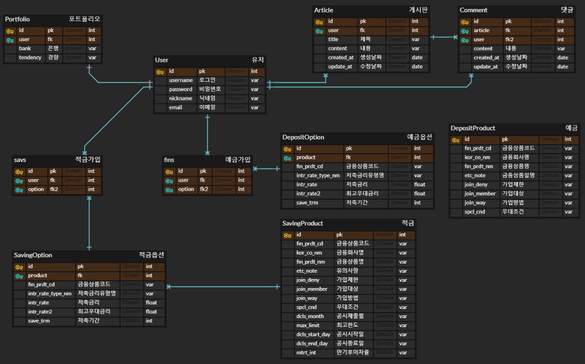

# final-pjt

## 1. 프로젝트 소개

- 여러분의 지갑 지킴이 `JS금융`입니다. 저희는 예적금 상품 비교 및 상품 추천 서비스를 제공하고, 카드 상품 비교도 가능합니다. 또한 지도를 통해 해당 지역의 은행을 조회할 수 있습니다.

- 실시간 환율 계산으로 직접 입력한 통화의 가치를 구할 수 있습니다.

- 커뮤니티를 통해 사용자들과 자유로운 소통을 하며 의견을 나눠보세요.

## 2. 설계 내용(아키텍처 등) 및 실제 구현 정도
- front
  - vue3, js, chartjs, swiper, bootstrap
- back
  - django, drf
- 구현
  - 메인 페이지
  - 회원 커스터마이징
  - 예적금 금리 비교
  - 환율 계산기
  - 근처 은행 검색
  - 커뮤니티
  - 프로필 페이지
  - 금융 상품 추천

## 3. 데이터베이스 모델링(ERD)

## 4. 금융 상품 추천 알고리즘에 대한 기술적 설명
### 포트폴리오를 활용한 상품 추천
- 회원을 외래키로 하는 포트폴리오 테이블을 추가로 생성
- tendency와 bank 설정을 통해 random으로 5개 추천
- 같은 조건으로 요청하면 매번 다른 데이터를 추천하여 반환

## 5. 서비스 대표 기능들에 대한 설명
- 메인
  - 주요 기능에 대한 링크와 간략한 안내
  - 콘텐츠(카드, 예적금, 은행 검색, 커뮤니티 등)를 제공
- 회원
  - 회원 가입, 회원탈퇴, 로그인을 통한 상품 가입, 게시글과 댓글 CRUD
  - 로그인한 사용자의 경우, 프로필에서 정보 확인, 가입한 상품의 데이터를 그래프로 제공, 포트폴리오를 통한 예적금 추천
- 예적금 상품 조회
  - 다양한 은행들의 예적금 상품의 금리 정보를 제공
  - 은행 및 금리 별 조회, 가입기능
- 커뮤니티
  - 회원들 간의 소통과 정보 공유를 위한 공간
- 편의 기능
  - 모바일 버전 : 모바일 모드일 때, UI가 다르게 나타납니다.
  - 은행 검색 : 사용자의 위치 정보 및 검색어를 활용, 주변에 위치한 은행을 찾음
  - 환율조회 및 환율 계산 : 사용자가 현재 환율 정보를 조회
